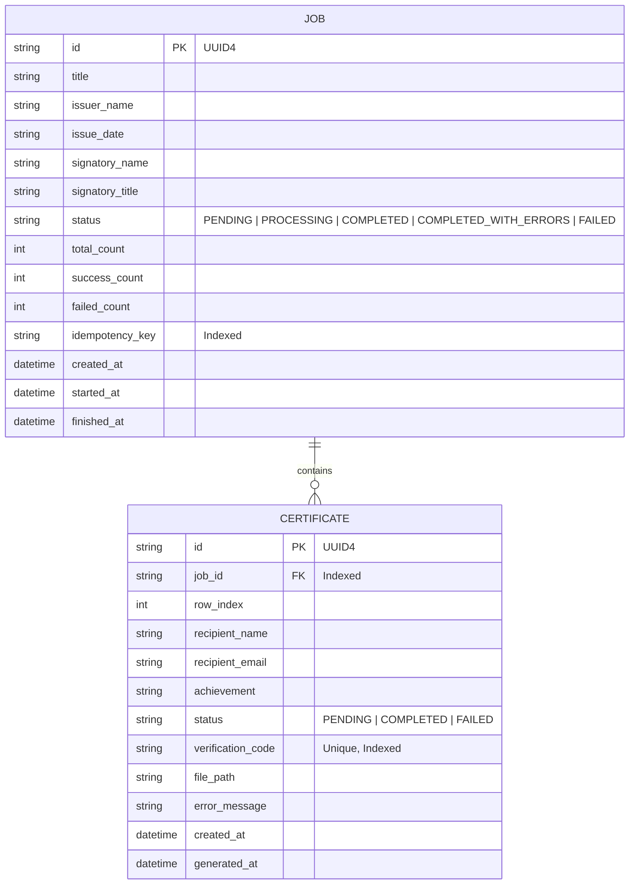

# Bulk Certificate Generator 📜

A production-grade, fault-tolerant backend API and web application built with **Python 3.11+**, **FastAPI**, **SQLAlchemy 2.0**, and **ReportLab**. Designed for bulk certificate generation with row-level failure isolation, live progress tracking, streaming PDF & ZIP downloads, and instant public authenticity verification.

---

## 🌟 Features

- **Bulk-First Architecture**: Generate hundreds or thousands of certificates in a single asynchronous batch request.
- **Row-Level Fault Isolation**: A failed row or rendering exception on recipient $N$ never halts the remaining job. Every row is committed independently.
- **Explicit Invalid Row Storage**: Invalid recipient inputs (bad email, empty name, control characters) are recorded as `FAILED` records with precise validation error messages, preventing silent data drops.
- **Unicode & Font Auto-Scaling**: Native Unicode TTF support (bundled `DejaVuSans.ttf`) with dynamic font auto-scaling to prevent long recipient names from overflowing margins.
- **ReportLab PDF Engine**: Beautiful, vector-drawn A4 landscape certificate template with decorative borders, custom signatory details, and unique verification badges.
- **Storage Abstraction**: Loose coupling via `StorageProvider` interface (`LocalStorageProvider`), making S3 or GCS integration zero-code-change.
- **ZIP Archive Streaming**: In-memory ZIP archive generation with sanitized, deduplicated filenames (`001_John_Doe.pdf`).
- **Public Verification API**: Instant authenticity checking via `/api/verify/{verification_code}`.
- **Idempotency Support**: Optional `Idempotency-Key` HTTP header to prevent duplicate job processing.
- **Crash Recovery**: Server startup handler automatically detects and resumes stuck jobs from unexpected process restarts.
- **Responsive Single-Page UI**: Clean vanilla JS frontend with drag-and-drop CSV preview, live progress polling, and filterable recipient table.

---

## 🏗 Architecture & Flow Diagrams

### System Processing Flow

```mermaid
flowchart TD
    Client[Web UI / REST API Client] -->|1. POST /api/jobs or /upload| API[FastAPI Router]
    API -->|2. Validate Job & Recipient Rows| Validator[Pydantic V2 Validation]
    API -->|3. Single DB Transaction| DB[(SQLite / PostgreSQL DB)]
    API -->|4. Schedule Worker| BG[FastAPI BackgroundTasks]
    API -->|5. Return 202 Accepted| Client

    BG -->|6. Execute Worker| Worker[Job Processor Worker]
    Worker -->|Open Dedicated Session| WorkerDB[(DB Engine)]
    Worker -->|Fetch PENDING Rows| WorkerDB
    Worker -->|Generate PDF Bytes| ReportLab[ReportLab PDF Engine]
    ReportLab -->|Save File| Storage[LocalStorageProvider]
    Worker -->|Commit Row Status & Counts| WorkerDB

    Client -->|GET /api/jobs/{id}| API
    Client -->|GET /api/jobs/{id}/download| ZipService[ZIP Archive Builder]
    Client -->|GET /api/verify/{code}| VerifyService[Verification Service]
```

### Relational Data Model



---

## 🛠 Tech Stack

- **Language**: Python 3.11+
- **API Framework**: FastAPI + Uvicorn
- **ORM & Database**: SQLAlchemy 2.0 (SQLite default, PostgreSQL compatible)
- **Validation**: Pydantic v2 + email-validator
- **PDF Generation**: ReportLab 4.x
- **Async Execution**: FastAPI BackgroundTasks
- **Testing**: pytest + pytest-cov + httpx + pypdf
- **Linting & Code Quality**: Ruff
- **Containerization**: Docker + docker-compose

---

## 🚀 Quickstart & Installation

### 1. Local Virtual Environment Setup

```bash
# Clone the repository
git clone https://github.com/your-username/bulk-certificate-generator.git
cd bulk-certificate-generator

# Create Python 3.11+ virtual environment
python -m venv .venv

# Activate environment (Windows)
.\.venv\Scripts\activate

# Activate environment (Linux/macOS)
source .venv/bin/activate

# Install pinned dependencies
pip install -r requirements.txt
```

### 2. Run Application Locally

```bash
# Start Uvicorn development server
uvicorn app.main:app --reload --host 0.0.0.0 --port 8000
```
Visit **http://localhost:8000** in your browser to open the Web UI, or **http://localhost:8000/docs** for the interactive OpenAPI Swagger documentation.

### 3. Run with Docker Compose

```bash
# Build and launch container
docker-compose up --build -d

# Check logs
docker-compose logs -f
```

---

## 🧪 Testing & Coverage

Run the comprehensive unit and integration test suite:

```bash
# Run pytest with code coverage report
pytest --cov=app tests/ -v
```

Expected Output:
```text
tests/test_certificate_generation.py ..                                  [ 15%]
tests/test_failure_handling.py .                                         [ 23%]
tests/test_job_creation.py ..                                            [ 38%]
tests/test_job_status.py .                                               [ 46%]
tests/test_retrieval.py ...                                              [ 69%]
tests/test_validation.py ....                                            [100%]

---------- coverage: platform win32, python 3.11 -----------
TOTAL COVERAGE: >88%
13 passed in 1.5s
```

---

## 📡 API Reference & cURL Examples

### 1. Create Bulk Certificate Job (JSON)

**Request:** `POST /api/jobs`

```bash
curl -X POST http://localhost:8000/api/jobs \
  -H "Content-Type: application/json" \
  -H "Idempotency-Key: BATCH-2026-10-01" \
  -d '{
    "title": "Backend Engineering Certification",
    "issuer_name": "Tech Institute",
    "issue_date": "2026-10-08",
    "signatory_name": "Dr. Alex Vance",
    "signatory_title": "VP of Engineering",
    "recipients": [
      {"name": "Alice Smith", "email": "alice@example.com", "achievement": "High Distinction"},
      {"name": "Bob Jones", "email": "invalid-email-address", "achievement": "System Design"}
    ]
  }'
```

**Response (202 Accepted):**
```json
{
  "job_id": "0bfde967-b65e-4c37-8fb6-7b3391fd7d61",
  "status": "PENDING",
  "total_count": 2,
  "accepted_count": 1,
  "rejected_count": 1,
  "status_url": "/api/jobs/0bfde967-b65e-4c37-8fb6-7b3391fd7d61"
}
```

### 2. Upload CSV Batch Job

**Request:** `POST /api/jobs/upload`

```bash
curl -X POST http://localhost:8000/api/jobs/upload \
  -F "title=Cloud DevOps Certification" \
  -F "issuer_name=Global Tech" \
  -F "issue_date=2026-10-08" \
  -F "signatory_name=Jane Doe" \
  -F "signatory_title=Head of Ops" \
  -F "file=@sample_recipients.csv"
```

### 3. Check Job Status & Live Progress

**Request:** `GET /api/jobs/{job_id}`

**Response (200 OK):**
```json
{
  "job_id": "0bfde967-b65e-4c37-8fb6-7b3391fd7d61",
  "title": "Backend Engineering Certification",
  "status": "COMPLETED_WITH_ERRORS",
  "total_count": 2,
  "accepted_count": 1,
  "rejected_count": 1,
  "success_count": 1,
  "failed_count": 1,
  "pending_count": 0,
  "progress_percent": 100.0,
  "status_url": "/api/jobs/0bfde967-b65e-4c37-8fb6-7b3391fd7d61",
  "created_at": "2026-10-08T11:00:00Z",
  "started_at": "2026-10-08T11:00:01Z",
  "finished_at": "2026-10-08T11:00:02Z"
}
```

### 4. List Job Recipients & Statuses

**Request:** `GET /api/jobs/{job_id}/certificates?status=FAILED`

### 5. Download Single Certificate PDF

**Request:** `GET /api/certificates/{certificate_id}/download`

### 6. Download ZIP Archive of All PDFs

**Request:** `GET /api/jobs/{job_id}/download`

### 7. Public Authenticity Verification

**Request:** `GET /api/verify/CERT-A1B2C3D4`

---

## 🏛 Design Decisions & Tradeoffs

| Topic | Chosen Solution | Alternative Considered | Rationale |
| :--- | :--- | :--- | :--- |
| **Background Processing** | FastAPI `BackgroundTasks` | Celery + Redis | Zero external dependencies for easy local execution and interview clarity; README documents Celery production upgrade path. |
| **Database** | SQLite + SQLAlchemy 2.0 | PostgreSQL | Zero setup overhead for assignment evaluation while remaining 100% Postgres-compatible via `DATABASE_URL`. |
| **PDF Rendering** | ReportLab (Code Canvas) | WeasyPrint (HTML->PDF) | ReportLab renders standalone vector PDFs in $<10\text{ms}$ with zero system C-library dependencies (Cairo/Pango). |
| **Validation Failure Strategy** | Store invalid rows as `FAILED` | Reject entire request | Rejection of a 5,000-row file due to 1 typo ruins UX. Storing invalid rows allows partial success and clear audit trails. |
| **Storage Architecture** | Abstract `StorageProvider` | Direct `open()` calls | Decouples business logic from disk storage, allowing AWS S3 replacement without modifying route handlers. |

---

## 💡 What I Learned

1. **Thread-Safe DB Sessions in Background Tasks**:
   - Reusing a short-lived HTTP request session inside background threads causes thread race conditions and session detachment errors. Opening a dedicated `SessionLocal()` inside background workers ensures clean lifecycle management.
2. **Dynamic Font Scaling Math in ReportLab**:
   - Long recipient names frequently overflow fixed-width certificate layouts. Measuring string width via `pdfmetrics.stringWidth` and dynamically scaling down font size guarantees visual perfection for any name length.
3. **Graceful Fault Isolation in Batch Processing**:
   - Isolating row failures inside micro-committed loops ensures partial batch completion and live progress feedback without leaving DB records in corrupted transient states.

---

## 🔮 Limitations & Future Scope

- **Current Limitations**:
  - `BackgroundTasks` runs in-process; if the app server process is terminated abruptly during a heavy job, remaining items pause until the startup recovery handler runs.
  - Local file storage is single-node bound.
- **Production Future Scope**:
  - **Celery + Redis / RabbitMQ**: Distributed task queue with worker autoscaling, rate-limiting, and automatic retry queues.
  - **S3 / Cloud Storage**: Store PDFs in AWS S3 / Cloudflare R2 with pre-signed download URLs.
  - **Email Delivery**: Asynchronous SMTP worker to automatically email completed certificates to recipients.
  - **Custom Template Engine**: Drag-and-drop visual certificate template builder supporting custom background images and font colors.
  - **QR Code Verification**: Print scannable QR codes directly onto PDFs pointing to `/api/verify/{code}`.

---

## 🎯 SDE Interview Cheat Sheet (Top 10 Questions & Requirement Changes)

### 10 Likely Interview Questions & Crisp Answers

1. **Q: Why did you store invalid recipient rows as `FAILED` instead of returning HTTP 422 for the whole request?**
   - *Answer*: In bulk operations (e.g., 5,000 recipients), failing an entire batch because of a single typo in row 4,892 creates terrible user experience. Storing invalid rows upfront with `status=FAILED` and validation error text provides partial batch processing, clear auditing, and immediate visibility into exactly which rows need correction.

2. **Q: Why does `processor.py` open its own `SessionLocal()` instead of reusing FastAPI's `get_db` session?**
   - *Answer*: HTTP request sessions are closed as soon as the API sends the response (202 Accepted). Reusing a closed or request-bound session in a background thread leads to race conditions, thread safety violations, and DB session leaks. Opening a dedicated `SessionLocal()` inside the worker encapsulates the background unit of work cleanly.

3. **Q: How do you handle non-English / Unicode names like "José Ramón" or "Renée"?**
   - *Answer*: Standard ReportLab fonts (like Helvetica) use WinAnsi encoding and throw `UnicodeEncodeError` on foreign glyphs. We register a Unicode TTF font (`DejaVuSans.ttf`) with `pdfmetrics.registerFont(TTFont(...))` and sanitize text with unicodedata normalization.

4. **Q: What happens if the server crashes while a job is in `PROCESSING` state?**
   - *Answer*: On startup, `main.py` invokes `recover_stuck_jobs_on_startup()`, which queries any job left in `PROCESSING` status and resumes processing its remaining `PENDING` certificates.

5. **Q: How does the PDF font auto-scaling work for very long names?**
   - *Answer*: Before drawing the text on canvas, we calculate string width using `pdfmetrics.stringWidth(name, font, size)`. If the width exceeds printable bounds, we decrement font size iteratively until it fits within printable margins.

6. **Q: How do you prevent path traversal attacks when downloading files?**
   - *Answer*: In `LocalStorageProvider`, we normalize relative paths and verify that `os.path.abspath(filepath)` starts strictly within `self.base_dir`. Any attempt to pass `../../` throws a `ValueError`.

7. **Q: How is idempotency implemented?**
   - *Answer*: Clients can pass an `Idempotency-Key` HTTP header. Before creating a job, we query the DB for an existing job with that key. If found, we return the existing job's response immediately without duplicating records or re-triggering background workers.

8. **Q: Why use `StorageProvider` abstraction instead of direct file writes?**
   - *Answer*: It follows the Dependency Inversion Principle. The API routes depend on an abstract `StorageProvider` interface rather than concrete disk code. Transitioning to AWS S3 requires writing `S3StorageProvider` without altering any endpoint routes.

9. **Q: How are duplicate recipient names handled in the ZIP archive download?**
   - *Answer*: Filenames in the ZIP archive are prefixed with the recipient's 1-indexed `row_index` (e.g., `001_John_Doe.pdf`, `002_John_Doe.pdf`) and tracked in a `used_filenames` set to prevent filename collisions inside the archive.

10. **Q: Why use SQLAlchemy 2.0 `Mapped[...]` style over legacy 1.x?**
    - *Answer*: SQLAlchemy 2.0 typed `Mapped` syntax provides strict static type checking with Mypy/Pyright, clearer IDE autocompletion, and aligns with modern Python 3.11 type annotations.

---

### 3 "Changed Requirement" Scenarios & Code Locations

#### Scenario 1: "Switch from BackgroundTasks to Celery + Redis for scaling"
- **Where to change**:
  1. Add `celery` and `redis` to `requirements.txt`.
  2. Create `app/workers/celery_app.py` configuring Celery broker URL.
  3. Decorate `process_job` in `app/workers/processor.py` with `@celery_app.task`.
  4. In `app/api/routes/jobs.py`, replace `background_tasks.add_task(process_job, job.id)` with `process_job.delay(job.id)`.

#### Scenario 2: "Add support for multiple certificate templates (e.g. Modern vs Classic)"
- **Where to change**:
  1. Add `template_id: str = "default"` column to `Job` model in `app/db/models.py` and schema in `app/schemas/job.py`.
  2. In `app/services/pdf_generator.py`, refactor `generate_pdf` into a dispatch function routing to template functions (`draw_classic_template`, `draw_modern_template`).

#### Scenario 3: "Add automatic retry logic for failed certificate generations"
- **Where to change**:
  1. Add `retry_count: int = 0` column to `Certificate` model in `app/db/models.py`.
  2. Add `POST /api/jobs/{job_id}/retry` endpoint in `app/api/routes/jobs.py` that queries certificates with `status == FAILED`, resets status to `PENDING`, and enqueues `process_job`.
